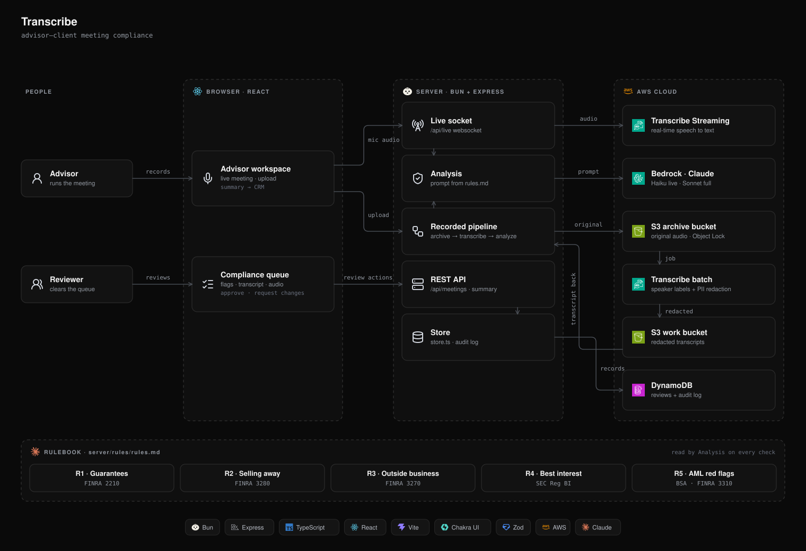
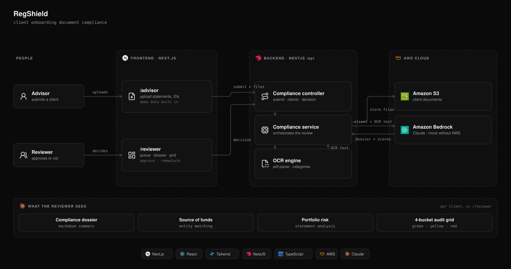

# LPL Hackathon

## Automating Compliance

AI tools that take routine compliance work off LPL's advisors and back-office reviewers. The repo holds two independent projects:

| Project | What it does | Stack |
| --- | --- | --- |
| [`Transcribe/`](Transcribe/) | Listens to advisor–client meetings, live or recorded, and flags compliance risks in what was said | Bun, Express, React + Chakra UI, AWS Transcribe, Bedrock, S3, DynamoDB |
| [`text-based/`](text-based/) (RegShield) | Reviews client onboarding documents and builds a compliance dossier for the back office | Next.js, NestJS, AWS Bedrock, S3 |

---

## Transcribe: meeting compliance

Advisors record or upload a client meeting. The server transcribes it with Amazon Transcribe, redacts personal information, and has Claude on Bedrock check the transcript against a rulebook. Compliance reviewers then work through flagged meetings in a queue.

- **Live mode:** streams microphone audio over a WebSocket and shows nudges to the advisor during the call.
- **Full analysis:** after the meeting, the whole transcript is checked and each flag gets a severity, a timestamp, and the rule's source.
- **Advisor summary:** an editable meeting summary that can be sent to the CRM.
- **Compliance queue:** reviewers see flagged meetings, the transcript, and each finding.

### Architecture



Live meetings stream audio to Transcribe Streaming and check each chunk with the faster live model. Recorded meetings are archived to S3, transcribed in batch with PII redaction, then analyzed in full. Both paths save a review record to DynamoDB, which the queue and summary views read.

The rules are in [`Transcribe/server/rules/rules.md`](Transcribe/server/rules/rules.md). They're based on public regulations and LPL's public disclosures:

| Rule | Covers | Source |
| --- | --- | --- |
| R1 | Promises or guarantees of returns | FINRA 2210 |
| R2 | Unapproved products (selling away) | FINRA 3280 |
| R3 | Outside business activity | FINRA 3270 |
| R4 | Weak best-interest basis or pressure to decide | SEC Reg BI |
| R5 | AML red flags such as structuring | Bank Secrecy Act; FINRA 3310 |

### Running it

You need [Bun](https://bun.sh) and AWS credentials with access to Transcribe, Bedrock, S3 and DynamoDB.

```sh
cd Transcribe
cp server/.env.example server/.env   # fill in buckets, table and model IDs
bun install
bun run dev                          # API on :3000, client on http://localhost:5173
```

AWS credentials come from your AWS profile or environment, never from `.env`.

### Test data and evaluation

`Transcribe/test-data/` holds scripted test meetings: two clean ones and five that each contain a planted violation. It includes the scripts, the audio, the redacted transcripts, and an answer key. To score the analyzer against the answer key:

```sh
cd Transcribe/server
bun scripts/evaluate.ts 3     # run 3 times to check the results are stable
bun test                      # unit tests
```

---

## RegShield: document compliance

Advisors upload a client's documents (brokerage statements, IDs). The backend runs OCR, then uses Bedrock to write a compliance dossier and score four areas green, yellow or red: AML/Identity, Reg BI, Disclosures, and Vulnerable Adult. Reviewers approve the client or send a remediation request.



*Both diagrams are generated by [`docs/build-diagrams.py`](docs/build-diagrams.py).*

```sh
# Backend: http://localhost:3001/api
cd text-based/backend && npm install && npm run start:dev

# Frontend: http://localhost:3000
cd text-based/frontend && npm install && npm run dev
```

AWS settings are optional. Without them the backend falls back to a built-in mock. See [`text-based/README.md`](text-based/README.md) for the demo walkthrough.

> Note: both projects default to port 3000, so run one at a time or change `PORT`.
